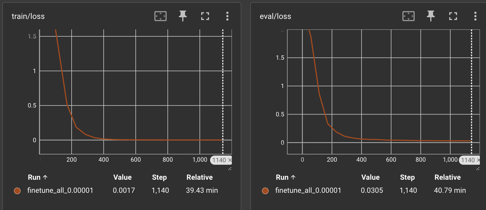

# Fine-Tuned Swin Transformer for German Traffic Sign Recognition

This repository contains a fine-tuned version of the pre-trained Vision Transformer model, `google/vit-base-patch16-224` on the German Traffic Sign Recognition dataset(GTSRB). The GTSRB dataset consists of ~40,000 training samples and ~12,000 testing samples. Each sample has an image of a traffic sign and its corresponding label (see below).

ToDo: include one image from each label

We only used ~4000 samples for fine-tuing and achieved an F1 score of 0.988 on the test dataset. 

## Model Details

### Architecture

- **Model Name:** google/vit-base-patch16-224
- **Source:** Hugging Face (https://huggingface.co/google/vit-base-patch16-224)
- **Training Data:** Originally trained on the ImageNet-21k dataset.
- **Parameters:** Approximately 86 million parameters.
- **Input Size:** 224x224

### Fine-Tuning Process

- **Dataset:** German Traffic Sign Recognition
- **Optimization:** Learning rate adjustment
- **Training Examples:** 4300
- **Evaluation Metric:** F1 Score
- **Achieved F1 Score:** 0.988
- **Learning rate:** 0.00001
- **Warm up ratio:** 0.1

## Strategies to obtain best F1 score
- Ensuring equal number of samples from each label during training
- Data augmentation - flip, rotate, scale the image
- Learning rate tuning

## Training and Validation Loss



## Negative Examples Analysis

The model's performance on certain examples was less than ideal. Below are plots showing some of these negative examples along with an analysis of why the model may have failed on these cases.


### Common Reasons for Failures:


## Usage

ToDO: include the link for the fine tuned model in hugging face

To use this fine-tuned model for inference, follow the steps below:

1. **Install Dependencies:**
   ```bash
   pip install transformers torch
   ```
2. **Run the inference**
   ```
   python vit_inference.py <image_path>
   ```

## References

ToDo: include the paper link
